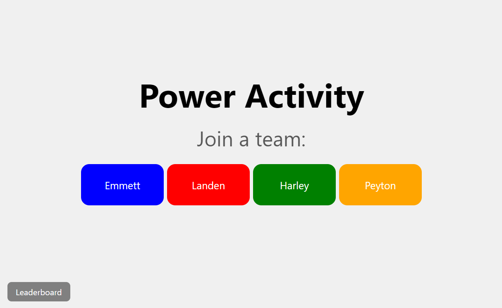
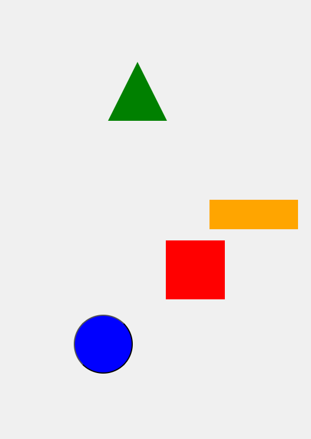
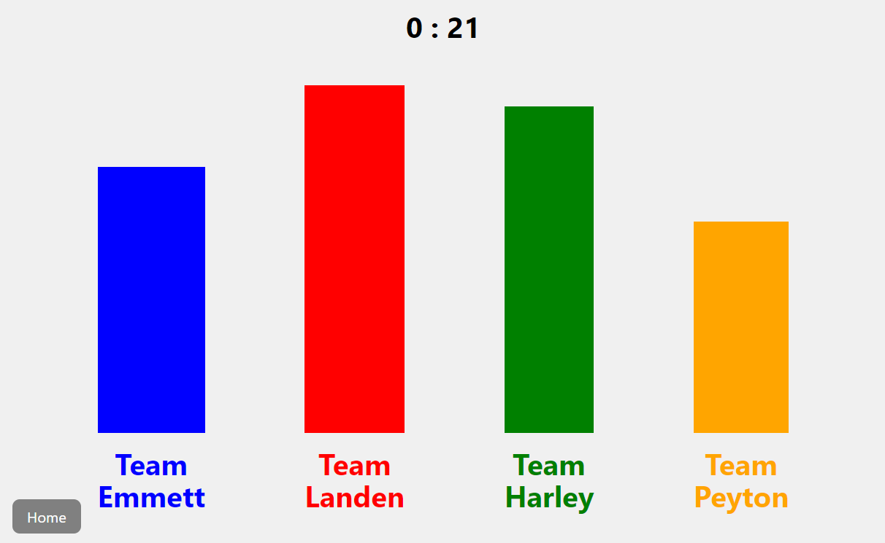
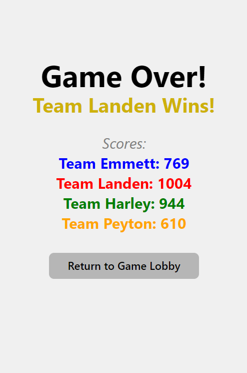

# Power Activity - Raikes Leadership II

[Live Demo](https://leadership-game-2fc66.web.app/)&nbsp;&nbsp;|&nbsp;&nbsp;<i>Created: Spring 2024 (College Sophomore)</i>
 

  
  

  
  

 

<b>Real-time responsive multiplayer game for Raikes Leadership II course to demonstrate different power types in management; was played by 40 students at the same time.</b>

Mainly was used as a supplemental tool, bulk of the activity was each manager explaining to their teams how to play the game in different power styles, then a discussion on how each power style affected their team's performance.

